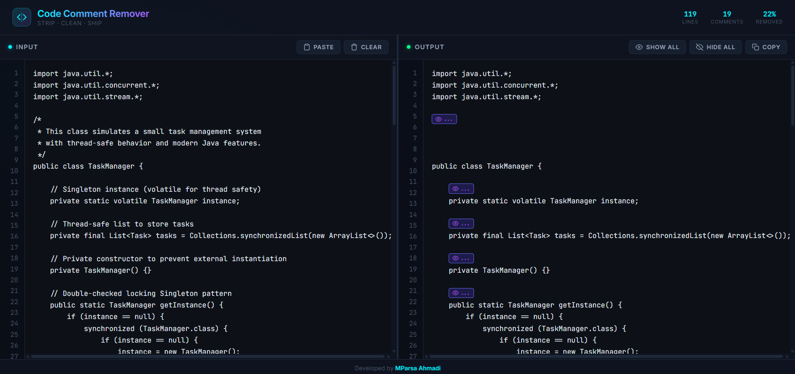

<div align="center">

# 🧹 Code Comment Remover

**Strip comments from your code instantly — with the power to bring them back.**

[](https://developer.mozilla.org/en-US/docs/Web)
[](https://mparsaahmadi.github.io/code-comment-remover/)
[](https://www.anthropic.com/)

---



<br>

<a href="https://mparsaahmadi.github.io/Code-Comment-Remover/" target="_blank">
  
</a>


<br>

</div>

---

## 📖 About the Project

**Code Comment Remover** is a free, browser-based tool that strips comments from source code in real-time — without destroying them.

Most comment-removal tools permanently delete your annotations. This one doesn't. Instead, every detected comment is replaced with a small **interactive marker**. Click the marker, and the original comment reappears exactly where it was. Click again, and it collapses. Your code's indentation, spacing, and logic remain **completely untouched**.

Everything runs **client-side** in a single HTML file. No servers, no sign-ups, no dependencies. Paste your code on the left, get clean code on the right — instantly.

---

## ✨ Key Features

| | Feature | Description |
|---|---|---|
| 🧠 | **Smart Parsing** | A single-pass, string-aware state machine that correctly detects `//`, `/* */`, `#`, `<!-- -->`, and `--` comments across **JavaScript, Python, C/C++, Java, HTML, CSS, SQL, Shell, Ruby, Go, Rust, PHP**, and more — while respecting string literals and edge cases. |
| 🔄 | **Interactive Recovery** | Comments aren't deleted — they're replaced with stylish clickable markers. Toggle any comment back into view with a single click. Use **Show All / Hide All** to control every comment at once. |
| 🔗 | **Synchronized Scrolling** | Mouse-wheel scrolling is proportionally synced between input and output panels in both directions, with loop-prevention logic to eliminate jitter. |
| 🎨 | **Zero-Distraction UI** | A modern dark cyberpunk aesthetic with neon accents, glow effects, and the **JetBrains Mono** monospaced font. No layout shifts. No visual noise. |
| ⚡ | **One-Click Actions** | Paste from clipboard, clear the editor, and copy clean output — each with a single button click and instant toast feedback. |
| 📐 | **Resizable Panels** | Drag the center divider to resize input/output panels to your preference. Full touch support included. |
| 📊 | **Live Statistics** | Real-time header stats showing total lines, comments found, and percentage of code removed. |
| 📱 | **Fully Responsive** | Adapts seamlessly from desktop to mobile — panels stack vertically on small screens. |

---

## 🛠️ Tech Stack

This project is intentionally dependency-free for maximum portability and performance.

| Layer | Technology |
|---|---|
| **Structure** | HTML5 (Semantic) |
| **Styling** | CSS3 (Flexbox, Custom Properties, Backdrop Filters) |
| **Logic** | Vanilla JavaScript (ES6+) |
| **Font** | [JetBrains Mono](https://fonts.google.com/specimen/JetBrains+Mono) via Google Fonts |
| **Icons** | Inline SVG (zero external libraries) |
| **Hosting** | [GitHub Pages](https://pages.github.com/) |

> **No frameworks. No bundlers. No node_modules.**
> Just a single `index.html` file — open it anywhere and it works.

---

## 🚀 Usage

### Live

Visit the deployed app at:\
👉 **[mparsaahmadi.github.io/Code-Comment-Remover](https://mparsaahmadi.github.io/Code-Comment-Remover/)**

### Local

```bash
# 1. Clone the repository
git clone https://github.com/MParsaAhmadi/code-comment-remover.git

# 2. Navigate into the project
cd code-comment-remover

# 3. Open the file in your browser
open index.html        # macOS
xdg-open index.html    # Linux
start index.html       # Windows
```

That's it. There's nothing to install, no `npm install`, no build step.

---

## 🎯 How It Works

```
┌─────────────────────┐         ┌──────────────────────────┐
│                     │         │                          │
│   INPUT PANEL       │         │   OUTPUT PANEL           │
│                     │  ────►  │                          │
│   Paste raw code    │  Real   │   Clean code with        │
│   with comments     │  Time   │   interactive markers    │
│                     │         │   in place of comments   │
│                     │         │                          │
└─────────────────────┘         └──────────────────────────┘
                                         │
                                    Click a marker
                                         │
                                         ▼
                                ┌──────────────────┐
                                │ Original comment  │
                                │ toggles in/out    │
                                └──────────────────┘
```

1. **Paste** your code into the left panel (or use the Paste button).
2. The parser **scans every character** in a single pass, respecting string literals and language-specific syntax.
3. Each detected comment is replaced with a **clickable marker** `[👁 ...]` in the output.
4. **Click** any marker to reveal the hidden comment. Click again to hide it.
5. **Copy** the output — collapsed markers produce clean code; expanded markers include the comment text.

---

## 🗂️ Supported Comment Styles

| Style | Languages | Example |
|---|---|---|
| `//` | JavaScript, TypeScript, C, C++, Java, Go, Rust, Swift, Kotlin | `// single-line comment` |
| `/* */` | JavaScript, CSS, C, C++, Java, Go, Rust, Swift, PHP | `/* block comment */` |
| `#` | Python, Shell, Ruby, Perl, YAML, TOML | `# comment` |
| `<!-- -->` | HTML, XML, SVG, Markdown | `<!-- comment -->` |
| `--` | SQL, Lua, Haskell, Ada | `-- comment` |

---

## 🤝 Development & Attribution

### Developer

**Built by [MParsa Ahmadi](https://github.com/MParsaAhmadi)**

### AI Transparency

> This project was **architected and coded with the assistance of [Claude](https://www.anthropic.com/claude) by Anthropic** — a large language model. From the initial architecture decisions and the comment-parsing state machine to the synchronized scroll logic and the cyberpunk UI design, AI was an integral collaborator throughout the development process.
>
> This project stands as a demonstration of the power of **AI-human collaboration** in modern software development: the developer provided the vision, requirements, and iterative feedback, while the AI contributed implementation, debugging, and optimization.

---

## 📄 License

You are free to use, modify, and distribute this project for any purpose.

---

<div align="center">

**If you found this useful, consider giving it a ⭐**

<br>

Made with 💜 by [MParsa Ahmadi](https://github.com/MParsaAhmadi)

</div>
